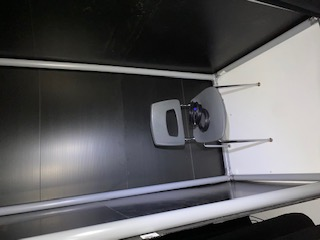
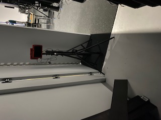

Essai Karine photo

# 3 minutes

### Créateurs/créatrices
* #### Naoufal Bensaiad-Jérémie Lévesque-Samuel Poulin

### Exploitation du temps
* ##### À travers le temps, le but de ce projet à été de sensibiliser la personne en la faisant expérimenter du bon temps et du mauvais temps à partir d'une immersion dans des activités tous autant plaisantes que déplaisantes.

### Ambiance
* ##### Joyeuse
* ##### Énergique
* ##### Peur

### Instalation
* #### Lors de notre visite, l'instalation du casier était la chose qui a le plus attiré notre attention.
* 
* 

### Schéma de plantation

* #### Source de l'image: https://tim-montmorency.com/2022/projets/3-minutes/docs/preproduction/medias/plantation2.drawio.png

### Intéraction
* #### Intéragir avec le jeu (jouer au ballon chasseur/s'enfermer dans un casier)
* #### Suivre les instructions du jeu

### Cours requis pour la création du projet
* #### Atelier de création d'images matricielles
* #### Réalité virtuelle
* #### Espace interactif
