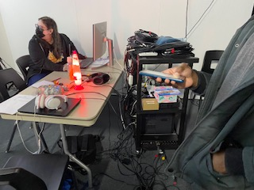

# Chère Sasha

### Créateurs/créatrices
* #### Trish Nguyen-Angelina De Silva Jeca-Karine Cormier-Sabrina Kayani

### Explotation du temps
* ##### Ils ont voulu démontrer l'influence que les croyances des proches d'une persone LGBTQ peut avoir sur celle-ci au fil du temps. 

### Ambiance 
* ##### Abandon
* ##### Solitude
* ##### Changement

### Instalation
* #### Lors de notre visite, ils revoyaient certaine étapes de codage pour perfectionner leur projet.

### Schéma de plantation 

* #### Source de l'image: https://tim-montmorency.com/2022/projets/Chere-Sasha/docs/preproduction/medias/plantation_01.jpg

### Intéraction
* #### Intéragir avec le jeu en écoutant et faisant ce qui est demandé (ex.: laisser des mots d'encouragement à Sasha)

### Cours requis pour la création du projet
* #### Gestion de projet multimédia
* #### Conception sonore
* #### Réalité virtuelle
