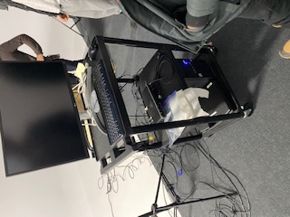

# Jeu temporel

### Créateurs/créatrices
* #### Raphaël Fillion-Philippe Trudel

Explotation du temps
* ##### Faire réaliser à la population les conséquences que nos actions auront sur l'environnement dans un  futur proche. La sensibilisation étant le but premier a fait évoquer chez les participants un moement troublant dû au changement d'ambiance répétitif que présente le jeu.

### Ambiance
* ##### Joie
* ##### Troublante

### Instalation
* #### Lors de notre visite, ils étaient en pleine révision de leur codage, mais ont quand même pris le temps de répondre à nos question sur l'immensité de leur instalation.

### Schema de plantation

* #### Source de l'image: https://tim-montmorency.com/2022/projets/Jeu-Temporel/docs/preproduction/medias/plans/plan_technique_new.png
 
### Intéraction 
* #### Intéragir avec les jeu (ex.: répondre aux questions)

### Cours requis pour la création du projet
* #### Interactivité Web
* #### Modélisation 3D
* #### Animation 3D
